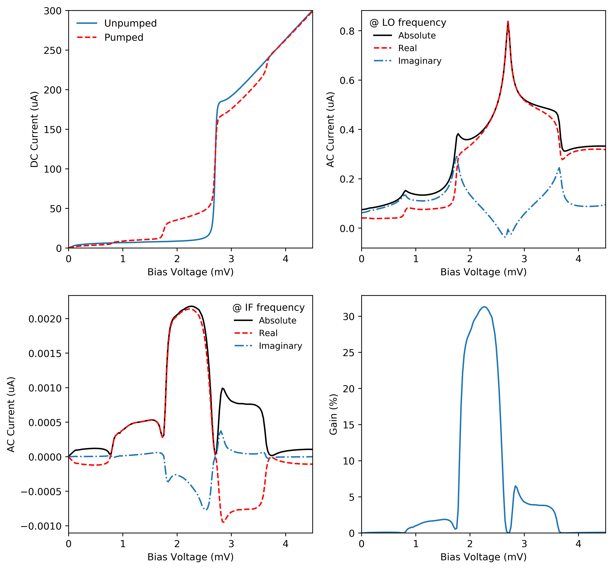

# QMix

*Quantum Mixing Software*

QMix is a software package that can be used to simulate SIS mixers. It uses multi-tone spectral domain analysis, which makes QMix ideal for simulating higher-order harmonics, power saturation and wide IF bandwidth devices. 

**Author:** John Garrett (john.garrett@physics.ox.ac.uk)

**Language:** Python 3.7

**Website:** https://garrettj403.github.io/QMix/

Installation
------------

Clone the repository and then add QMix to your Python path environment variable. See the [QMix website](https://garrettj403.github.io/QMix/setup.html) for more information.

Examples
--------

Here is an example of a simple SIS mixer simulation. See ``workflow-examples/`` for more!

References
----------

- J. Garrett, ["A 230 GHz Focal Plane Array Using a Wide IF Bandwidth SIS Receiver,"](https://ora.ox.ac.uk/objects/uuid:d47fbf3b-1cf3-4e58-be97-767b9893066e) DPhil thesis, University of Oxford, Oxford, UK, 2018.

- P. Kittara, "The Development of a 700 GHz SIS Mixer with Nb Finline Devices: Nonlinear Mixer Theory, Design Techniques and Experimental Investigation," DPhil thesis, University of Cambridge, Cambridge, UK, 2002.

- P. Kittara, S. Withington, G. Yassin, "Theoretical and numerical analysis of very high harmonic superconducting tunnel junction mixers," *Journal of Applied Physics,* 101, 2, pp. 024508, Jan. 2007.